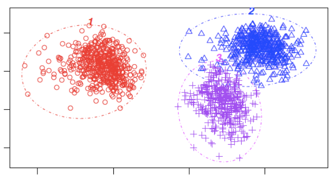
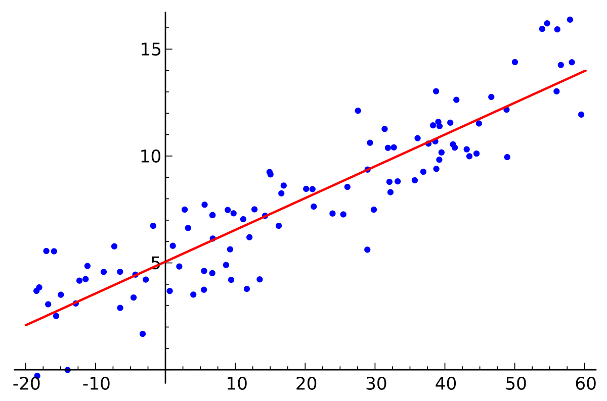
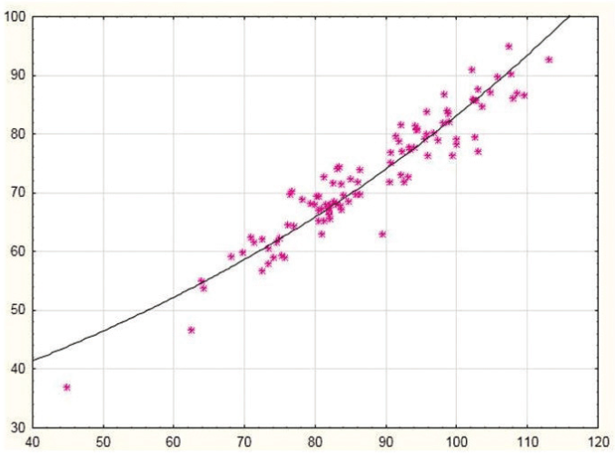

## Data science

Multidisciplinary detailed analysis of different problems and data structures. This purpose requires data mining to ensure patterns and tends are coherent with data distribution

To ensure understanding of the data bases, it's needed to have some basic knowledge of statistic and probability. In order to understand data it's also required to make some plots, such as heatmap, regression plots, etc.

#### As an example
In health it usually used data science for diagnostic of diseases 

---

## Tools

- Statistic & probabilistic: It describes and summarize a set of data through tools like:

    - Measures of central tendency

        - Mean: It's the average of the set of data

        - Median: It' the value of the intermediate of a data set sequentially. If the **set is odd** the **value in the middle is the median**, if the data **set is even** the median **must be** calculated through the **average** between central 2 values

        - Mode: Most frequently found value or values

        - Variance: It measures how scattered are the values of a data set **regarding median**

        $$
        s^{2}= \sum_{i=1}^{n}{\frac{(x_i-\hat{x})^{2}}{n-1}}
        $$

        

        #### As an example:
        
        The calculus of the variance is used in ML algorithms such as cluster method

        - Standard deviation: It's the scattered measure of the data in the same measurement units of the real data
        
        $$
        s = \sqrt{s^2} = \sqrt{\sum_{i=1}^{n}{\frac{(x_i-\hat{x})^2}{n-1}}}
        $$

        - range: $range = maximum - minimum$ it calculates the data length to get the variability of total data

        > Note: It's better to use a meta heuristic instead of a variance

    - Statistical inference measures:
    
    This means how different a group is from other, basically hypotheses
        - Hypotheses: It's a procedure that allow you to take decisions over a population based on their sample data. To beginning with a hypotheses it requires a base population or control population (Null hypotheses, $H_0$), also an alternative population ($H_1$ or $H_a$), that population will suffer changes. Another point of view about hypotheses test is null hypotheses ($H_0$) and alternative hypotheses ($H_1$ or $H_a$).
            - Research question if not fulfilled $= H_0$
            - Research question is fulfilled $= H_a$
        To accept or refuse an hypotheses it's necessary to calculate the significancy level ($\alpha$)
        > $\alpha$ can be calculated through a function, a plot or the amount of data
        - Confidence interval: Represents the range of data in which there's an important metric you need or you're interested in, generally they are around $95 - 99\%$. It's a calculated range that is estimated including the real value of a population parameter
        - Regression analysis: It looks for a relation between 2 variables or characteristics
        
        
        > Note: Any data can be represented through any function, it depends if it matches the data or not
        - Variance analysis (ANOVA): It's a technique used to compare 3 or more groups. Basically it looks for differences between groups (That must be a significantly difference)
    - Probability and stochastic analysis:
    What we need to make one of those analysis is:
        - Historical & experimental analysis (Exa. 100y)
        - Sampling spaces, results from previous experiments
        - Event probability calculus, it's done with ranges between $1$ and $0$
        - Rules of probability $=$ Add (Union of events), Multiply (Events intersection), etc
        - Random variables and distributions (Exa. Wheatear nowadays)
        - Bayes theorem is used updated the events of the hypotheses. Basically, it updates the value of a probability
        - Stochastic analysis for generation of future scenarios
            - Analysis of a set of scenarios in a single model

## Data analysis with autonomous learning

(If it completely AL) It uses as support artificial intelligence for collection data with different structures in a continuos way. **BUT**, it requires a pretty good position for sensors to be installed (Cameras, Mics, etc) and storage systems

### Data Preprocessing or cleaning stage

- It's a procedure before starting the analysis, in which you clean up `NAN` or reading error, you remove column, lines or empty spaces

- Data base correction, as wrong words, numbers, dates, etc

- You can also add missing data using a deep analysis

> Note: This section is basically SQL see [Codd rules](https://es.wikipedia.org/wiki/Normalizaci%C3%B3n_de_bases_de_datos#Reglas_de_Codd)

### High quality databases

##### Data density
Defines final volume of the analysis and can transform a big data problem into a small or usually a middle size problem

##### Discretization
Means that our discretized data comes from data which is integer values (It increase the problem complexity). It belongs to NP-complete or NP-Hard problems